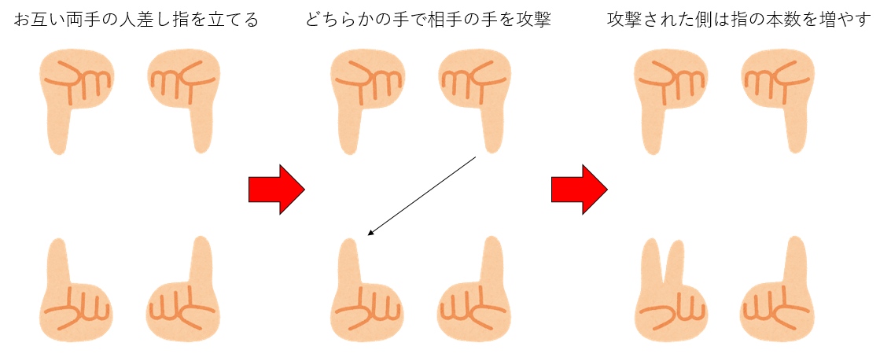
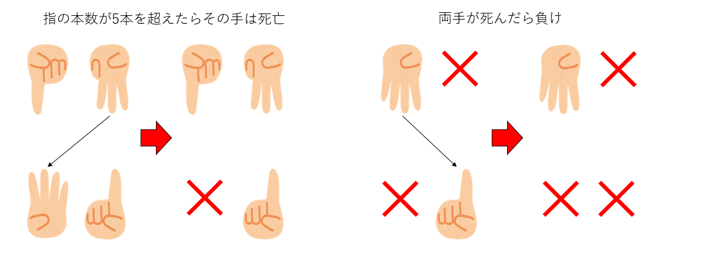
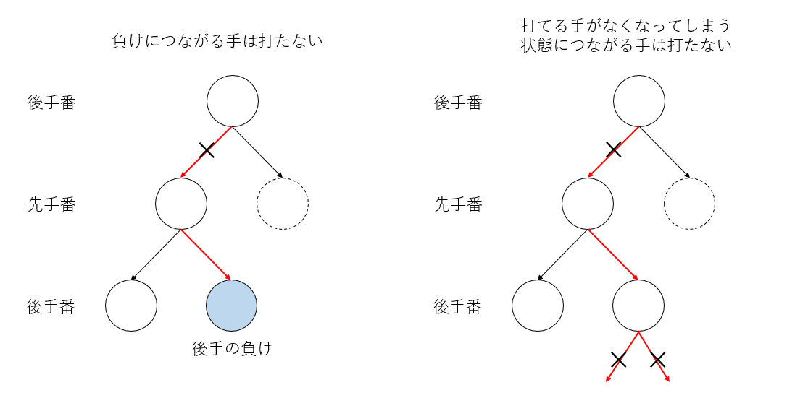

# 「割りばし」が後手必勝であることを確認する

## はじめに

「割りばし」という二人で行う指遊びがある。地方によって名前やルールは様々だが、基本ルールは以下のようなものだ。

1. じゃんけんなどで先行、後攻を決め、お互い両手の人差し指を立てる
2. 先行は、自分の好きな手で相手の好きな手を攻撃する
3. 攻撃された側は、攻撃された手の指を、攻撃した手の指の本数だけ増やす
4. この時、もし指が5本以上になったらその手は死ぬ
5. これを交互に繰り返し、両手が死んだら負け




追加ルールやバリエーションとして、以下のようなものがある。

* modルール：攻撃されたとき、「ちょうど5」でなければ死なず、指の本数は5で割った余りになる
* 分身ルール：自分の手番で、手が一本死んでいるとき、指の総数が変わらないように両手に指を分けることができる
* 自分攻撃：自分の手で自分を攻撃することを許す

特にmodルールはかなり広い範囲で採用されているようだ。

さて、簡単のため、基本ルールだけを考えよう。死んだ手の指の本数を「5本」と数えると、お互いの指の本数は、ターン毎に必ず増加する。すなわち、千日手は存在せず、必ず有限ターンでゲームが終わる。また、勝負が決まるのは相手の最後の手を殺した時だけなので、引き分けは存在しない。ランダム要素もないため、先手か後手のどちらかが必勝であることがわかる。

実際、このゲームは後手必勝である。それを見てみよう。というのが本稿の趣旨である。

ソースは以下においてある。

## 状態遷移図

考えるべき状態は、先手の指の本数と後手の指の本数、そして現在先手番か後手番かだけである。状態数が有限なので、再帰でたどってグラフを作るのは難しくないと思われるが、単純に実装すると状態が多すぎるので、両手の指の本数をソートしよう。つまり、（右x本,左y本）という状態と、(右y本,左x本)という状態を同一視する。複数の状態から同じ状態に遷移してくる場合があるので、状態遷移グラフは厳密には「木(tree)構造」じゃないのだが、ここでは木と呼ぶことにしよう。

グラフを描くのはGraphvizで一発である。ノード一覧とエッジ一覧のリストを作り、Graphvizに木を描かせるのが簡単だが、後で後手必勝を見るために木をたどる必要があるので、自分で木構造を作ろう。

とりあえずノードを表す、こんなクラスを作るんですかね。

```py
class State:
    def __init__(self, is_first, f, s):
        self.is_first = is_first
        self.f = [max(f), min(f)]
        self.s = [max(s), min(s)]
        self.siblings = []
        self.is_drawn = False

    def params(self):
        return (self.is_first, self.f, self.s)

    def __eq__(self, other):
        return self.params() == other.params()

    def __str__(self):
        s = str(self.f) + "\n" + str(self.s)
        if self.is_first:
            return "f\n" + s
        else:
            return "s\n" + s

    def has(self, node):
        return node in self.siblings

    def next_state(self, fi, si):
        d = self.f[fi] + self.s[si]
        f2 = self.f.copy()
        s2 = self.s.copy()
        if d >= 5:
            d = 0
        if self.is_first:
            s2[si] = d
        else:
            f2[fi] = d
        return State(not self.is_first, f2, s2)
```

自分の状態(先手番かどうか、先手番と後手番の指の本数)と、子ノードの情報(`siblings`)を保持している。`__eq__`を実装しているのは、子ノードリストに同じ`State`オブジェクトがあるかどうかを`in`で判定させるためだ。また、現在の状態から「fi番の手でsi番の手を攻撃」した後の状態を返す`next_state`を実装してある。

これができてしまえば、再帰で木を作るのは簡単だ。

```py
def move(parent, index, is_first, nodes):
    fi, si = index
    if parent.f[fi] == 0 or parent.s[si] == 0:
        return
    child = parent.next_state(fi, si)
    if parent.has(child):
        return
    s = str(child)
    child = nodes.get(s, child)
    nodes[s] = child
    parent.siblings.append(child)
    for i in [(0, 0), (0, 1), (1, 0), (1, 1)]:
        move(child, i, not is_first, nodes)


def make_tree():
    nodes = {}
    root = State(True, [1, 1], [1, 1])
    nodes[str(root)] = root
    move(root, (0, 0), True, nodes)
    return root
```

`make_tree`を呼べば、初期状態を根とする木構造が返る。

可視化はGraphvizを使おう。一つだけ注意すべき点は、ナイーブに描画すると、同じエッジが複数本描かれてしまうことだ。ある状態に複数のパスから到達可能なので、同じエッジを何回も通ることになる。あるペアを結ぶエッジを一本しかかかないようにするためには

* エッジの辞書を作って、すでに描画済みか調べる
* ノードに状態を持たせて、すでに描画済みか調べる

などの方法が考えられるが、ここは安直に後者を選んだ。`State`クラスに`is_drawn`プロパティを持たせて、描画済みなら描かないことにする。以上を実装するとこうなる。

```py
def make_graph(node, g):
    if node.is_drawn:
        return
    node.is_drawn = True
    ns = str(node)
    if max(node.f) == 0:
        g.node(ns, color="#FF9999", style="filled")
    elif max(node.s) == 0:
        g.node(ns, color="#9999FF", style="filled")
    else:
        g.node(ns)
    for n in node.siblings:
        g.edge(ns, str(n))
        make_graph(n, g)

root = make_tree()
g = Digraph(format="png")
make_graph(root, g)
g.render("tree")
```

作成した木の根を渡して、そこから順番にたどってノードとエッジを作っていくだけだが、描画済ノードなら`return`している。また、勝負が決した状態がわかりやすいように、先手番の勝ちを青く、後手番の勝ちを赤く塗っている。

こうして作成した状態遷移図はこんな感じになる。


左右の手の順番を縮退させて状態数を減らしたが、それでも165ノード、エッジは273本あり、人間の目で解析するのはしんどい。
さらに、先手番勝利、後手番勝利のノードがそれぞれ8個ずつあり、これだけではどちらが有利かは判断できない。

## 後手必勝解析

さて、このゲームが後手必勝であることを可視化してみよう。引き分けがないのだから、負けにつながる手を打たなければ勝てるはずである。
先手に勝ち筋がある場合、当然先手はその手を打つ。
したがって、後手は「先手に勝ち筋があるような状態につながる手」を打ってはならない。そこで、そこにつながる手を枝刈する。
また、枝刈をした結果、打てる手がなくなってしまうノードが出てくる。このようなノードにつながる手も打ってはならないので、
それも枝刈する。



以上を実装するとこんな感じになるだろう。

```py
def prune(node):
    if max(node.s) == 0:
        return True
    if node.is_first:
        for n in node.siblings:
            if prune(n):
                return True
        return False
    if not node.is_first:
        sib = node.siblings.copy()
        for n in sib:
            if prune(n):
                node.siblings.remove(n)
        if len(node.siblings) == 0:
            return True
    return False
```

これに`root`を食わせてから描画すると、以下のような状態遷移図を得る。


各ノードで、fが先手番、sが後手番、上段が先手番の指の本数、下段が後手番の指の本数である。例えば

```py
f
[1,0]
[3,1]
```

は、先手番で、先手が指一本、もう片方の手は死亡、後手番は3本と1本、という状態を表している。先手番がどのような手を打とうとも、後手番がこの図のように対応すると必ず後手番勝利のノードに到達できることがわかる。

なお、単に「負けにつながる手を打たない」という方針で枝を刈ったので、勝てる手がある場合でも、わざわざ先手番を延命させる手も打ったりしているが、まぁそこはそれ。

## まとめ

「割りばし」という指遊びの基本ルールバージョンについて後手が必勝であることを可視化してみた。再帰で木を作って可視化しようとする場合、意外に手頃な例がない。例えば三目並べは実装は簡単だが対称性で落としても相当な状態数があるし、小さいオセロも「そこに置けるかどうか」の判定がやや面倒くさい。「割りばし」は有効手の判定が簡単で、かつ状態数もさほど多くなく、それなりに非自明なので面白い。

なお、modルールや分身ルールなどを採用すると千日手が出現するため、おそらく両者最善手を打つと勝負が決まらないと思われる。試しにmodルール版の状態遷移図を可視化してみたが、とても人間に理解できるような図にならなかった。

そうそう、Pythonのコードは`numba.jit`で[早くなることがある](https://qiita.com/kaityo256/items/3c07252ab63591256835)のだが、このコードは逆に遅くなる。numbaがどういう実装をしているか知らないが、おそらく関数ごとにJITコンパイルしているのだろう。すると、「重くて呼び出し回数が少ない関数」は高速化できるが、「何度も呼ぶ軽い関数」はJITの恩恵が得られず、逆にJITコンパイルの時間だけ遅くなると思われる。再帰は典型的な「なんども呼ぶ軽い関数」なので、JITをかけると遅くなったのでは、と思う。
